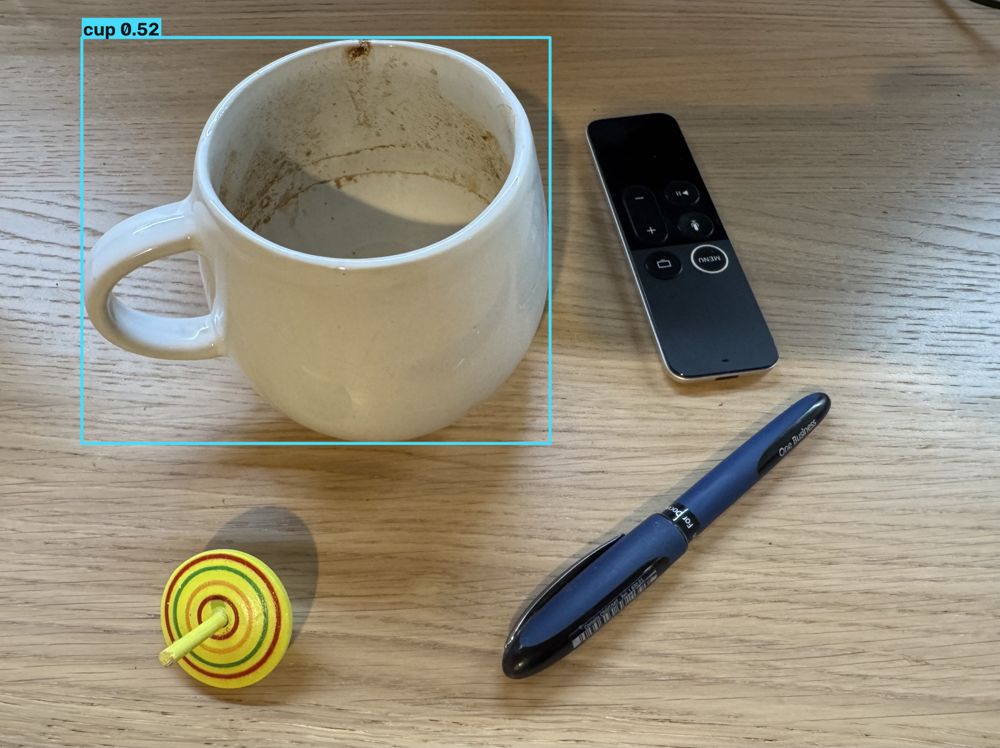
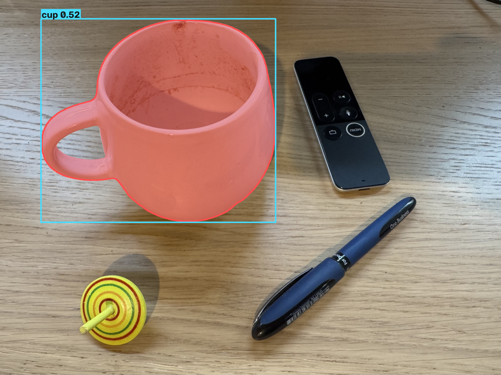
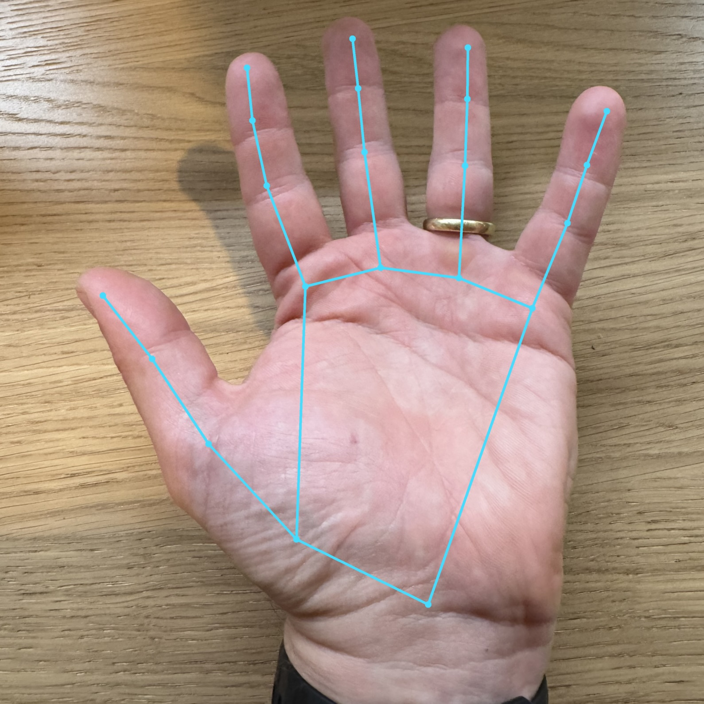

import PerceptionOutputs from '@/components/PerceptionOutputs.astro'

## Three answers to one question

A camera hands the robot a grid of numbers. Perception turns that grid into an answer to one
question: where is something, and what is it? Three models give three answers, each finer than the
last.

<PerceptionOutputs />

Same frame, three outputs. None of them needs the others. You pick the answer your task needs.

## A box

The loosest answer: a rectangle and a label. Here the model was asked for a cup and boxed it. That
is enough to know the object is there and roughly where. It runs many frames a second, so it keeps
up while the robot moves.

Common detectors are YOLO, RT-DETR and Grounding DINO.

## An outline

Tighter: the exact pixels of the object. SAM traced the cup, handle and all. This is the answer you
need to grasp it or to step around it.

Common here are YOLO for fast masks and Segment Anything for precise ones.

## A skeleton

The most specific: the position of each joint. It reads the joints straight from the image, so it
needs neither the box nor the outline first. A wave lives here, in how the wrists move, where a box
can never see it.

Common here are MediaPipe, MoveNet and RTMPose.

## Nobody taught it to wave

The skeleton gives coordinates, not meaning. Waving is a rule we wrote on top:

- the wrist sits above the shoulder
- it swings side to side across about a second

Both true at once, and we call it a wave. No model was trained on waving. In Station 4 this rule
becomes a skill, and in Station 5 the agent decides when to use it.

## What it gets wrong

- backlight and glass wreck the measurements
- a model only sees what it was trained on, everything else is invisible to it
- the skeleton jitters between frames, so the wave rule watches a full second, not one
